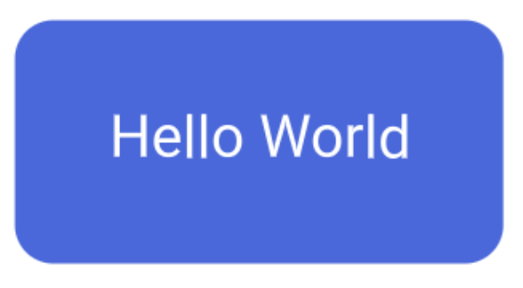
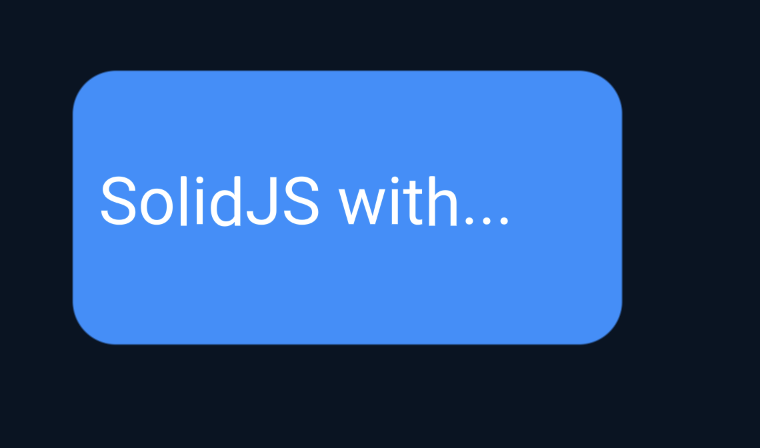
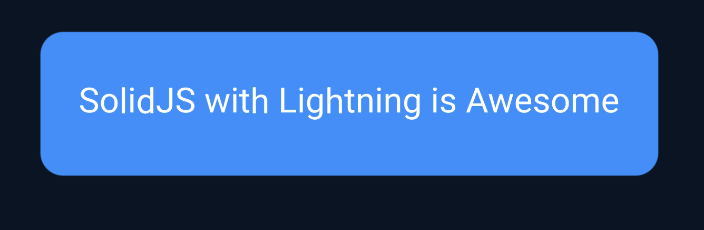
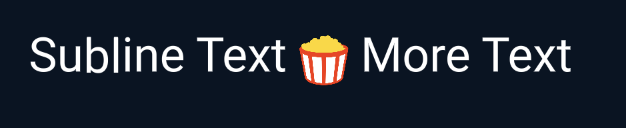
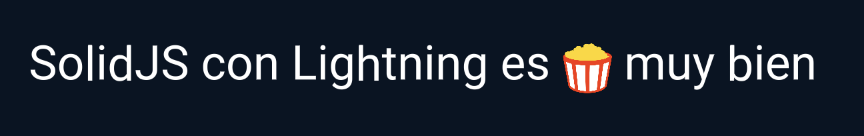
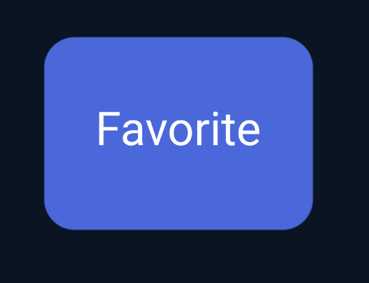
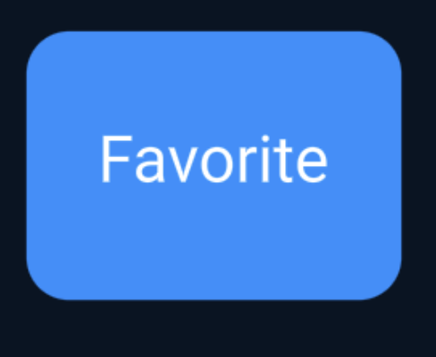
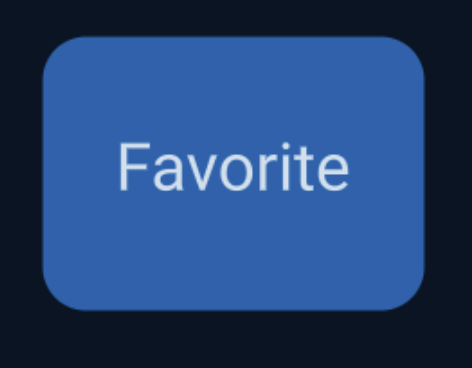

# Lightning 3: The Basics of SolidJS

[SolidJS](https://www.solidjs.com/) is the fastest, full-featured frontend framework ever made. It’s often compared to React, the most popular framework, because of their similarities, but SolidJS stands out with its superior performance. This can be a game-changer, especially when developing for low-power devices. That’s why [SolidJS integration layer](https://github.com/lightning-tv/solid) with the [LightningJS renderer](https://www.lightningjs.io/), is an excellent choice for building high-performance apps.


#### What About Blits?

Blits is the "official" framework of Lightning, developed by the Lightning team from scratch. It's a frontend framework that uses the Lightning renderer in much the same way the SolidJS integration does, just with different syntax and features. It's similar to how Vue and React are both frontend frameworks that use web DOM and CSS to build web apps. Now, let's dive into how we'd use SolidJS with Lightning.

## Quick Start

To kick things off, let’s set up a SolidJS app with a starter template built specifically for Lightning.

```sh
> npx degit lightning-tv/solid-starter-template my-app
> cd my-app
> npm i # or yarn or pnpm
> npm start # or yarn or pnpm
```

This will clone the starter template, which gets you up and running with a basic “Hello World” app in no time. If you want something more fleshed out, check out the demo app: https://github.com/lightning-tv/solid-demo-app.


Once inside the starter template, you’ll notice a few key files:

- **index.tsx**: The entry point of your app. It contains the configuration for both the LightningJS renderer and the Solid Router.
- **App.tsx**: Your main app wrapper. It’s like the outer shell for your app — think navigation bars, backgrounds, and global layouts.

You’ll also see that we’re using TypeScript by default (hence `.ts` and `.tsx` file extensions). If you’re using VS Code, you’ll enjoy the sweet auto-completion for most of the code, making it even easier to get going!

## Configuring the Renderer

Let’s take a peek inside `index.tsx` to see some of the Lightning-specific configurations.

```jsx
// Default font settings for all <Text> nodes
Config.fontSettings.fontFamily = 'Roboto';
Config.fontSettings.color = 0xffffffff;

// Settings for Lightning 3 Renderer passed in for starting application
Config.rendererOptions = {
  numImageWorkers: 2,
  fontEngines: [SdfTextRenderer],
  renderEngine: WebGlCoreRenderer,
  inspector: Inspector,
  // Set the resolution based on window height
  deviceLogicalPixelRatio: window.innerHeight / 1080,
  devicePhysicalPixelRatio: 1,
  boundsMargin: 20,
};
```

Here, we’re setting up a few important things:

- We’re customizing font settings for all `<Text>` nodes.
- The `rendererOptions` allow us to pass options to the Lightning renderer, including the number of image workers, font engines, and pixel ratios.

## Routing with SolidJS Router

Routing in SolidJS is handled with the popular [SolidJS Router](https://github.com/solidjs/solid-router), why write your own? It’s robust, fast, and flexible.

```jsx
// Lazy load routes easily with lazy
const TextPage = lazy(() => import('./pages/Text'));

// Create the renderer and load fonts
const { render } = createRenderer();
loadFonts(fonts);

// Render the app using the HashRouter from SolidRouter
render(() => (
  <HashRouter root={App}>
    <Route path="/" component={HelloWorld} preload={getHomeData} />
    <Route path="/text" component={TextPage} />
    <Route path="/*all" component={NotFound} />
  </HashRouter>
));
```

Lazy-loading routes? Oh yeah! This helps reduce the initial bundle size and lets your app boot up super fast. The cool thing about SolidJS Router is the ability to preload data for routes before they fully load. By following the “render as you fetch” pattern, we can make API calls while a component is being rendered, giving us that super snappy feel.

If you need different sections of your app with varying layouts (say, some with a sidebar and some without), you can easily structure it like this:

```jsx
render(() => (
  <HashRouter root={App}>
    <Route path="/main" component={LeftNav}>
      <Route path="/" component={HelloWorld} preload={getHomeData} />
      <Route path="/text" component={TextPage} />
    </Route>
    {/* These routes won't have left nav */}
    <Route path="/*all" component={NotFound} />
  </HashRouter>
));
```

Here, any route under `/main` will include a left-side navigation bar, but routes outside of that won’t. There is lots the router can do and I recommend you check out their [official documentation](https://github.com/solidjs/solid-router).

## Focus Management and Accessibility

In `App.jsx`, we start seeing the power of SolidJS and Lightning’s ecosystem working together. Take a look at this:

```jsx
const App = (props) => {
  useFocusManager({
    Announcer: ["a"],
    Menu: ["m"],
    Text: "t",
    Escape: ["Escape", 27],
    Backspace: ["Backspace", 8],
    Left: ["ArrowLeft", 37],
    Right: ["ArrowRight", 39],
    Up: ["ArrowUp", 38],
    Down: ["ArrowDown", 40],
    Enter: ["Enter", 13],
  });
  useMouse();
  const navigate = useNavigate();
  const announcer = useAnnouncer();
  announcer.debug = false;
  announcer.enabled = false;
  // ...
```

The `useFocusManager` is the go-to for handling key events, like those from remote controls or keyboards. For instance, pressing "t" will trigger an `onText` callback. You can dive into all the details on focus management in the [SolidJS Lightning docs](https://lightning-tv.github.io/solid/#/essentials/focus?id=focus-key-handling-or-remotes).

`useMouse` adds support for remote controls like the LG Magic Mouse, while `useAnnouncer` integrates accessibility features, like screen reader voice-out for focused elements. All this out of the box.

## The Power of JSX

SolidJS embraces JSX for templating, which makes the development process feel super natural and fluid. JSX is well supported in editors and has been widely adopted thanks to React. Why change a good thing...

```jsx
return (
  <View
    ref={window.APP}
    onAnnouncer={() => (announcer.enabled = !announcer.enabled)}
    onLast={() => history.back()}
    onText={() => navigate('/text')}
    onMenu={() => navigate('/')}
  >
    <View color={0x071423ff} />
    {props.children}
  </View>
);
```

Here, our `<View>` is handling all sorts of actions, like toggling the announcer or navigating between routes. It’s also a great example of how key events naturally bubble up through the DOM, with parent components catching unhandled events from their children. This is our main App wrapper, and `props.children` is filled with a Page.

## Page Components

Pages in SolidJS are nothing more than components themselves—simple functions that take in props. You can import any components you need and simply return them as part of your page. No need to register pages in any special way; it's all just components under the hood.

```jsx
const HelloWorld = (props) => {
  return <Text>Hello World</Text>;
};

export default HelloWorld;
```

See how simple that is? The `HelloWorld` page is just a function that receives `props` (an object with key-value pairs) to pass around. There’s no need to define what those props are ahead of time; just treat them like a dynamic object. And the best part? There’s no performance overhead for calling these functions. You can create as many components as you want and use them freely without worrying about extra resource consumption. SolidJS’s reactivity engine ensures everything is blazing fast.

## Core Components: `<View>` and `<Text>`

There are two key components that you’ll rely on when building apps in Solid with Lightning: `<View>` and `<Text>`. These correspond to the core Lightning renderer primitives (everything's a node or text in the renderer). Let's build a simple button:

```jsx
<View width={300} height={150} color="#4169e1" borderRadius={24}>
  <Text textAlign="center" contain="both" lineHeight={150} width={300}>
    Hello World
  </Text>
</View>
```

Each attribute gets passed straight through to the Lightning renderer. And remember, since Lightning is rendering to a canvas, every element is positioned like `position: absolute` would be in HTML/CSS, giving you precise control over layout. Everything has an `x` and a `y` position which default to 0,0 if not present. We've made a simple button:



## Reusable Components: A Button

Reusability is one of the things that makes frontend frameworks so much fun. Let’s make our button component reusable.

```jsx
export function Button(props) {
  return (
    <View {...props} width={300} height={150} color="#4169e1" borderRadius={24}>
      <Text textAlign="center" contain="both" lineHeight={150} width={300}>
        {props.children}
      </Text>
    </View>
  );
}
```

Now we have a simple button component that accepts props, making it easy to customize and reuse throughout our app. Yup, it's just a function returning JSX. The same as pages. There is no performance overhead to creating components as they are just functions. But what if we wanted different colors or widths?

## Adding Styles for Flexibility

We can improve our button’s flexibility by introducing a style object. This also has the benefit of keeping our styles separate from the UI, similar to how CSS works with HTML. We could import our styles from another file or leave them inline - choice is yours.

```jsx
import { View, Text } from '@lightningtv/solid';

export function Button(props) {
  const buttonStyle = {
    width: 300,
    height: 150,
    color: '#4169e1',
    borderRadius: 24,
  };

  const textStyle = {
    textAlign: 'center',
    contain: 'both',
    fontSize: 36,
    lineHeight: 150,
    width: 300,
  };

  return (
    <View {...props} style={buttonStyle}>
      <Text style={textStyle}>{props.children}</Text>
    </View>
  );
}
```

This allows us to create more flexible buttons by applying default styles that can be overridden with props. We can also reuse styles following your standard object spread giving us a ton of flexibility rather than writing the same styles over and over again.

```js
const defaultHeader = {
  fontSize: 32,
  fontWeight: 600,
};

const largeHeader = {
  ...defaultHeader,
  fontSize: 48,
};
```

One problem we have no is all the buttons are a set size... let's fix that.



## Layout with Flex

Flex is a fundamental tool for building layouts. By using [flex implementation](https://lightning-tv.github.io/solid/#/flow/layout?id=flex) for Solid, we can create layouts that are responsive and easy to manage. Let’s make a button that resizes based on the size of it's text:

```jsx
import { View, Text } from '@lightningtv/solid';

export function Button(props) {
  const buttonStyle = {
    display: 'flex',
    height: 150,
    color: '#4169e1',
    borderRadius: 24,
  };

  const textStyle = {
    fontSize: 36,
    lineHeight: 150,
    marginLeft: 40,
    marginRight: 40,
  };

  return (
    <View {...props} style={buttonStyle}>
      <Text style={textStyle}>{props.children}</Text>
    </View>
  );
}
```

With `display: flex`, it’s easy to create dynamic layouts where content automatically adjusts based on the size of the text or other items.



This is especially important with dynamically loaded content or switching user languages or putting images in between text. Check out this example:

```jsx
const SublineContainer = {
    width: 900,
    height: 36,
    gap: 6,
    display: "flex",
    flexDirection: "row",
    justifyContent: "flexStart",
}

<View style={SublineContainer}>
  <Text style={Subline}>Subline Text</Text>
  <View width={28} height={28} src={'/assets/rt-popcorn.png'} />
  <Text style={Subline}>More Text</Text>
</View>
```



Pretty powerful stuff. Could you imagine doing this without flex? Using callbacks and resizing things and moving their X positions to make things work? What if you had to support alternative languages?



With flex, everything just lays out how you'd expect.

## SolidJS Signals: Reactivity Made Simple

One of the killer features of SolidJS is its fine-grained reactivity system, which lets you manage state effortlessly.

```jsx
import { createSignal } from 'solid-js';
import { Button } from '../components/button';

const HelloWorld = () => {
  const [isFavorite, setIsFavorite] = createSignal(false);

  return (
    <Button onEnter={() => setIsFavorite((p) => !p)} autofocus x={50} y={50}>
      {isFavorite() ? 'Unfavorite' : 'Favorite'}
    </Button>
  );
};

export default HelloWorld;
```

 

See that `createSignal` function? That’s how we handle state changes. Solid’s reactivity is incredibly efficient, only updating the parts of the DOM that need to change. Oh, and that "state" doesn't have to be part of the component. They can be global or pulled in from a shared `state.js` file. You can easily separate your app state from your UI, no tight coupling.

## Fancy Focus Effects

Want to add a little flair to your buttons? Let’s throw in some transitions and focus styles.

```jsx
export function Button(props) {
  const buttonStyle = {
    height: 150,
    color: '#4169e1',
    alpha: 0.8,
    scale: 1,
    borderRadius: 24,
    focus: {
      alpha: 1,
      scale: 1.1,
    },
    transition: { alpha: true, scale: true },
  };

  return (
    <View {...props} style={buttonStyle}>
      <Text>{props.children}</Text>
    </View>
  );
}
```

 

Now, when the button is focused, it’ll smoothly scale up and increase in opacity — perfect for drawing attention to UI elements. Let's wrap this up bringing it all together:

## Dynamic Content with `<For>`

Let’s say you want to dynamically generate buttons based on a list of items. SolidJS provides the `<For>` directive to handle this easily.

```jsx
import { createSignal, For } from 'solid-js';
import { Row } from '@lightningtv/solid-ui';
import { Button } from '../components/button';

const HelloWorld = () => {
  const buttons = [
    {
      label: 'Favorite',
      action: () => console.log('Favorite clicked'),
      color: 0x1e90ffff,
    },
    {
      label: 'SolidJS',
      action: () => console.log('SolidJS clicked'),
      color: 0x4682b4ff,
    },
    {
      label: 'Lightning',
      action: () => console.log('Lightning clicked'),
      color: 0x556b2fff,
    },
    {
      label: 'Rocks',
      action: () => console.log('Rocks clicked'),
      color: 0xcd853fff,
    },
  ];

  return (
    <Row x={50} y={50} gap={50}>
      <For each={buttons}>
        {(button) => (
          <Button color={button.color} onEnter={button.action}>
            {button.label}
          </Button>
        )}
      </For>
    </Row>
  );
};

export default HelloWorld;
```


With SolidJS’s fine-grained reactivity, generating dynamic content like this is a breeze. And with Lightning’s powerful rendering engine, you’re guaranteed smooth, lightning-fast performance — pun intended!

---

That’s just scratching the surface of what you can do with **SolidJS** and **Lightning 3**. To dive deeper, check out the resources below:

- **Official Website**: [lightningtv.dev](https://lightningtv.dev)
- **GitHub Repository**: [github.com/lightning-tv/solid](https://github.com/lightning-tv/solid)
- **Join the Community**: [Discord](https://discord.gg/PJ4MBvJeXN)
- **Connect with me**: [Chris Lorenzo on LinkedIn](https://www.linkedin.com/in/chris-lorenzo/)
